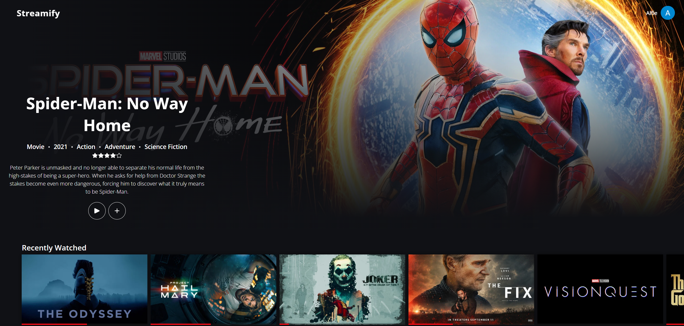

# Streamify

[](https://streamify-teal-tau.vercel.app/)


A web app for discovering movies and TV series and tracking what you've watched, including episode progress for series and total runtime for films.

**[Try the live demo](https://streamify-teal-tau.vercel.app/)**



## Features

- **Discover:** browse movies and series, and find where to watch them
- **Track progress:** mark individual episodes as watched and log movie runtimes
- **Secure sign-in:** Google OAuth 2.0 authentication, so your watch history is private, saved and synced across devices
- **Automated CI/CD:** GitHub Actions runs the tests and deploys to Vercel automatically on every push or pull request

## Tech Stack

| Area | Technology |
| --- | --- |
| Frontend | React, Vite |
| API | TMDB API |
| Deployment | Vercel |
| Backend | Vercel serverless functions |
| Database | Supabase (PostgreSQL) |
| Authentication | Google OAuth 2.0 |
| DevOps | GitHub Actions CI/CD, Vercel |
| Testing | Vitest |

## Install

Install the project dependencies and the Vercel CLI:

```bash
npm install
npm install -g vercel
```

Create a TMDB API access token and a Supabase project, then add these values to your `.env` file:

```
TMDB_ACCESS_TOKEN=
VITE_SUPABASE_URL=
VITE_SUPABASE_PUBLISHABLE_KEY=
```

## Testing

Run the test command to check that the application is working properly:

```bash
npm run test
```

Tests also run automatically in CI before every deployment.

## Deployment

```bash
npm install -g vercel
vercel deploy
```

## Credits

This product uses the TMDB API but is not endorsed or certified by TMDB.

Built by [@alfiebyte](https://github.com/alfiebyte).